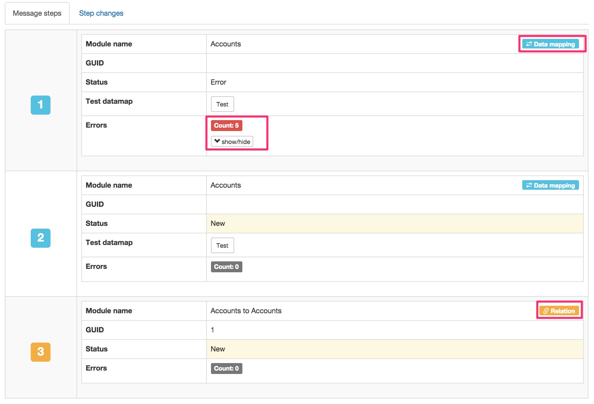

# Message Handler
Message handler is a PHP implementation of a small messaging system specifically oriented at synchronising data from databases, web services and other systems into SugarCRM. The general idea of the system is split collection of data from say a public register from the entry of data - and to avoid having a sync system where the sync process is hidden from the users - thereby making it very difficult to detect or handle errors. The data collection part of the system is called a Collector. The data entry part that synchronises data into SugarCRM is called a worker. Message handler can also run custom SQL scripts and has a nice web interface for handling errors in the synchronisation.

## Web Interface
The general idea of the web interface is to be able to see and monitor every synchronisation process in Message Handler - with the purpose of ensuring swift resolution of errors.

## Menu

### Messages
In messages you can get an overview of all messages currently in the system. Any message with a created date older than two months and status `Finished` or status `Cancelled` will be removed every day.

Its possible to search in messages on `Status`, `Created from`, `Created to` and `Containing`. Containing is a wildcard search in the message on the data in steps and payload. For instance you can search for a VAT number here - but be aware its a wildcard search - so anything matching the same number will be found (this is unlikely to produce any results though).

In `Status overview` its possible to get an overview of the number of messages in the different statuses. Status overview has an ajax refresher - and will automatically update at regular intervals.

The actual messages can be seen in the last section in the bottom. You can see the `ID` of the message (`ID` is cronological), `Create` which is the date time the message was created. The message `Type` which is one of:  

**New** - Message is awaiting processing.  

**In Progress** - Message is being worked. If a specific message has been running for more than 5 minutes - its possible to restart it as it may have failed due to system updating etc.  

**Error** - Message working went wrong. Remember to check the error in the message. It could also be detection of a dublet record or some other error where the worker could not proceed without human interaction.  

**Halted** - The message has been halted (paused) by the user.  

**Finished** - All steps in the message has been done (or cancelled) and the message is now finished (no more steps to process) and no errors occurred.


In the bottom of the message table its possible to choose actions for both selected and for all messages.


Actions are:  

**Set status New** - This resets the GUIDs in the message steps and sets all steps to status New. This affects both global message status and also step statuses.    

**Halt message** - Pause/Halt the message processing. This is a global status - it does not affect step statuses.  

**Cancel message** - This is a global status - it does not affect step statuses.

**Reset GUIDs** - This removes any GUID from the message steps. Basically it causes the worker to search again for the SugarCRM record instead of assuming the GUID.


Be careful when running `Action for all` this runs the action on the current filtered messages (all of them - not only the selected ones).


Actions can also be run on individual messages (each row). Once action is special here - the `Run now` action that makes the message run as soon as possible. `Run now` messages run every minute. Don't start too many messages with this setting - it's meant for a small amount of messages <50 only.


Clicking the `Details` button of a message reveals the actual message and also a possibility to see steps and the data map used. 


Click on Message steps `show/hide` in order to see the message steps - this varies according to the message type.


Click on Message `show/hide` in order to see the message payload (source system data) - this varies depending on the message.

Further down its possible to see a message step overview. Here you can see the status of each step. Steps are worked in order from 1 to highest step number. Steps can be either `Data mapping` meaning they either create or update a record - or they can be `Relation` meaning that they create or update a relation between two records.



You can click `Test` to check the data mapping from source system to SugarCRM.  


In `Step changes` you can see the status changes per step over time.


#### Fixing errors
Errors must ALWAYS be fixed from lowest ID to highest ID first. This is the standard sorting method in the message table overview.  


### Schedules

In schedules it's possible to schedule collectors, workers and SQL queries. Collectors and workers cannot run in parallel - and if a collector or worker overlap - this will be prevented if a collector or worker already runs. This is not the case for SQL queries.


**ID** - the database ID of the schedule.  

**Cron** - is the scheduling - it's done the following way:  

Cron time definition consists of five values: minutes, hours, day of month, month, day of week (0 for Sunday to 6 for Saturday)  

Asterisk * means: every possible value of given unit.  

Slash / lets you select from a range of numbers those divisible by some number, e.g.: */3 will run every tree minutes: 0, 3, 6, 9...  

Dash - creates a range of numbers, e.g. 7-19 means everything between 7 and 19 (inclusively)  

Comma , creates a set of numbers, eg. 3,7,15 will run on 3 and 7 and 15.  

**Cron Examples**

* * * * * - every minute.  

*/2 * * * * - every even minute.  

0 9-17 * * * - on whole hours from nine to five.  

0 8-16/2 * * 1 - on 8, 10, 12, 14 and 16 o' clock, but just on mondays.  

0 8,10,12,14,16 * * 1 - same as above.  

**Description** - here you can write a nice long description of what is being scheduled.  

**Last run at** - when was the schedule run last time.  

**Enable / Disable** - here its possible to enable or disable the schedule.  

Be careful when editing or deleting a schedule - there is no undo possibility.  

### Datamaps
The idea of a data map is to map the source JSON message into a format compatible with the SugarCRM api. In this mapping its possible to see which source data source fields end up in which fields in SugarCRM.

Here is an overview of some data maps.


Each data map has an ID, a name (which is often used in the PHP code) a type and a description to better understand the purpose of the data map.

Once the data map has been named - the data map name should not be changed.

The data map type is for internal code use.

The data map description allows you to describe in sentences what the data map purpose is.

The actual data map is a JSON that specifies field transformations between the source and destination system. Here is an excerpt of a data map for the NNE worker (also used for Create Account and NNE Reverse Lookup).

```
[
    {
        "source": "Company.officialName",
        "target": "name",
        "format": "string",
        "default": "",
        "comment": "The account name."
    },
    {
        "target": "billing_address_country",
        "format": "string",
        "default": "DENMARK",
        "comment": "The account billing address country - hardcoded to DENMARK for NNE data."
    },
    {
        "source": "Company.phone",
        "target": "phone_office",
        "format": "string",
        "default": "",
        "comment": "The account phone number.",
        "OnlyUpdateIfBlank" : true
    },
    {
        "source": "Company.email",
        "target": "email1",
        "format": "string",
        "default": "",
        "comment": "The account e-mail.",
        "OnlyUpdateIfBlank" : true
    },
    {
        "source": "Company.foundedYear",
        "target": "founded_year_c",
        "format": "string",
        "default": "0000",
        "comment": "The account founded year."
    },
    {
        "source": "Company.numberOfEmployees",
        "target": "employees_no_c",
        "format": "integer",
        "default": -1,
        "comment": "The number of employees for the account."
    },
    {
        "source": "CompanyFinance[0].grossProfit",
        "target": "gross_profit_c",
        "format": "integer",
        "default": 0,
        "comment": "The newest yearly annual accounts gross profit."
    },
    {
        "source": "Company.tdcId",
        "target": "nne_account_id_c",
        "format": "integer",
        "default": -1,
        "comment": "The primary key for NNE data (tdc_id_c)."
    },
    {
        "source": "Company.legalEntity",
        "target": "legal_entity_c",
        "format": "mapping",
        "mapping": {
            "1": true,
            "0": false
        },
        "default": true,
        "comment": "Is the account the mother company."
    },
    {
        "source": "Company.updateDate",
        "target": "nne_data_datetime_c",
        "format": "datetime",
        "mapping": {
            "input-format": "Y-m-d H:i:s.u",
            "output-format": "Y-m-d H:i:s"
        },
        "default": "",
        "comment": "NNE updated their data on this date."
    },
    {
        "source": "CompanyFinance[0].profit",
        "target": "profit_c",
        "format": "integer",
        "default": 0,
        "comment": "The newest yearly annual accounts profit."

    },
    {
        "target": "mh_nne_account_datetime_c",
        "format": "function",
        "mapping": {
            "function": "date",
            "arguments": ["Y-m-d H:i:s"]
        },
        "comment": "The message system updated the account on this date and time."
    },
    {
        "target": "assigned_user_id",
        "format": "string",
        "default": "12345-67890-12345-67890-12345-67890",
        "comment": "Assigned User ID",
        "OnlyUpdateIfBlank" : true
    }
]

The data map has certain mapping fields that are possible to use:

`source` - the name of the source JSON field in the message. This can be an actual JSON field or for instance the first in an array.


```

### Logs
In logs its possible to search in the production logs. There is a general log a collector log and a worker log. It may also be possible to see dev logs - and these can be ignored.


In order to search a log - you have to choose the filename of the log first - and then its possible to search in this log using the other fields. Logs are rotated **(HOW OFTEN) **- and its only possible to search in the latest log.

### Create Account
In this section its possible to create accounts from VAT numbers (DK). You must enter a valid VAT number - and depending on the settings of the creation module - only the main VAT number will be created or the main VAT number along with all sub VAT numbers (P numbers) will be created. At the moment only Danish vat numbers can be entered - as create depends on the NNE collector and worker.


It is also possible to import a list of VAT numbers (a text file with one column - no header with 8 digit Danish VAT numbers). The list is imported by a cron job - so it does not start immediately after upload.


In details its possible to see how many messages were created per VAT number - in case there are several P numbers on the VAT number. It's also possible to delete imported lists (this does not delete the messages created by the list).

## Collectors
Collectors create messages in Message Handler for further processing.

There is a range of collectors with different functionality - collectors have dynamic documentation inside Message Handler.

## Workers
Workers work messages created in Message Handler by the collectors. Collectors and workers can run asynchronously.

There is a range of workers with different functionality - workers have dynamic documentation inside Message Handler.

## SQL Queries
SQL Queries can be used to run SQL queries against the SugarCRM database at regular intervals.